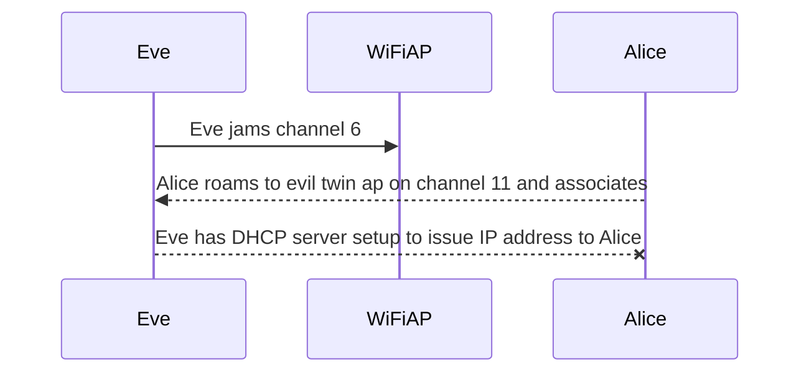

## What is Evil Twin AP Attack?

An evil twin is a malicious Wi-Fi access point (AP) that appears to be legitimate but is set up to eavesdrop on traffic, establish "man-in-the-middle" (MitM) positions with the intention of stealing sensitive information like usernames and passwords. Laptops, tablets and smartphones cannot distinguish between fake and real APs that have the same name (SSID).

## Defense Against The Attack
use VPN
<!--stackedit_data:
eyJoaXN0b3J5IjpbODA0MDE4MDA1LDMwMTkwNTk1MF19
-->