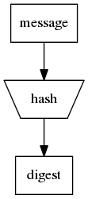
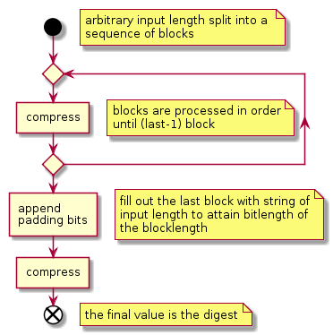

## secure one-way hash functions

hash functions take as an input an arbitrary length message and produce a fixed size result. The hash result is also known as the digest or the fingerprint.



two properties hash functions must have to be useful:

- one-way function: finding the message given only the digest is nontrivial
- collision resistance: finding another input that produces the same digest is nontrivial

almost all real-life hash functions are iterative hash functions. This structure allows you to start computing the hash of an input as soon as you have the first part of it. So in applications where a stream of data is to be hashed, the message can be hashed on the fly without ever storing the data.



hash functions are used in many scenarios. Here are their most common applications:

- file manifests
- storing password
- generate unique Id: commit hashes in git, bitcoin addresses
- pseudorandom number generation
- proof-of-work algorithm

here are list of modern cryptographic hash algorithm that are secure enough for most application:

`SHA-2`   
> SHA-256, SHA-384, and SHA-512 are based on the cryptographic concept "merkle-damgard" construction. SHA-256 is widely used by developers (e.g. in the bitcoin blockchain). SHA-512 uses 128-byte blocks instead of the 64-byte blocks SHA-256 use.

`SHA-3`   
> Keccak is the winner of the SHA-3 NIST competition and is based on the cryptographic concept "sponge" construction. Unlike SHA-2, the SHA-3 family are not vulnerable to the "length extension" attack. SHAKE128 and SHAKE256 are variants of the SHA-3 

`BLAKE2`   
> BLAKE2 is a family of fast hash functions and is one of the finalists at the SHA-3 NIST competition. BLAKE2s is optimized for 32-bit microprocessors and BLAKE2b is optimized for 64-bit

calculating cryptographic hash functions in python:

```python
import hashlib, binascii

text = 'hello'
data = text.encode("utf8")

sha256hash = hashlib.sha256(data).digest()
print("SHA-256:   ", binascii.hexlify(sha256hash))

sha3_256 = hashlib.sha3_256(data).digest()
print("SHA3-256:  ", binascii.hexlify(sha3_256))

blake2s = hashlib.new('blake2s', data).digest()
print("BLAKE2s:   ", binascii.hexlify(blake2s))
```
